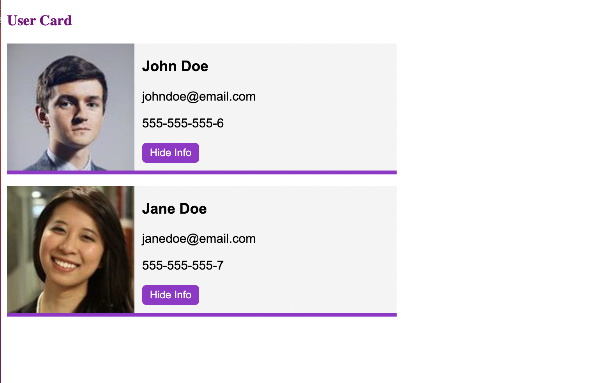
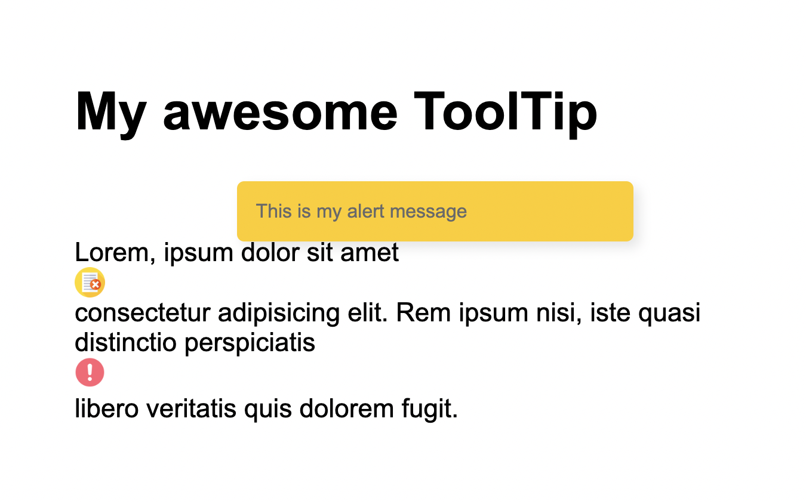
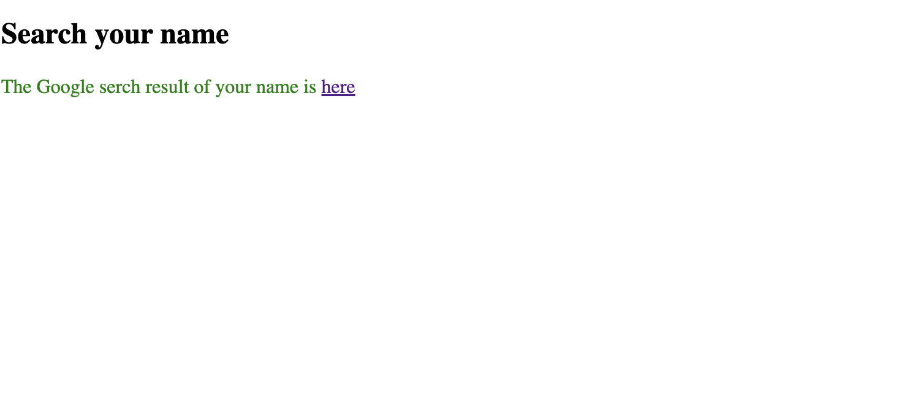
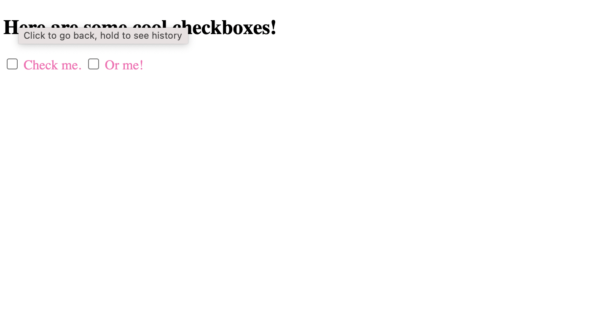
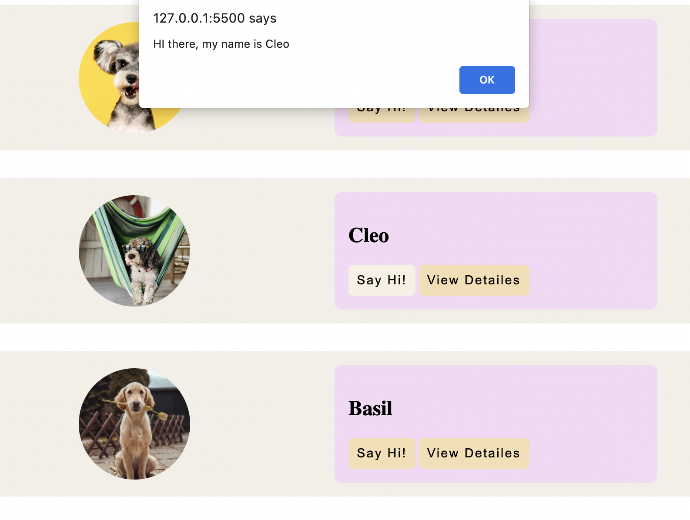
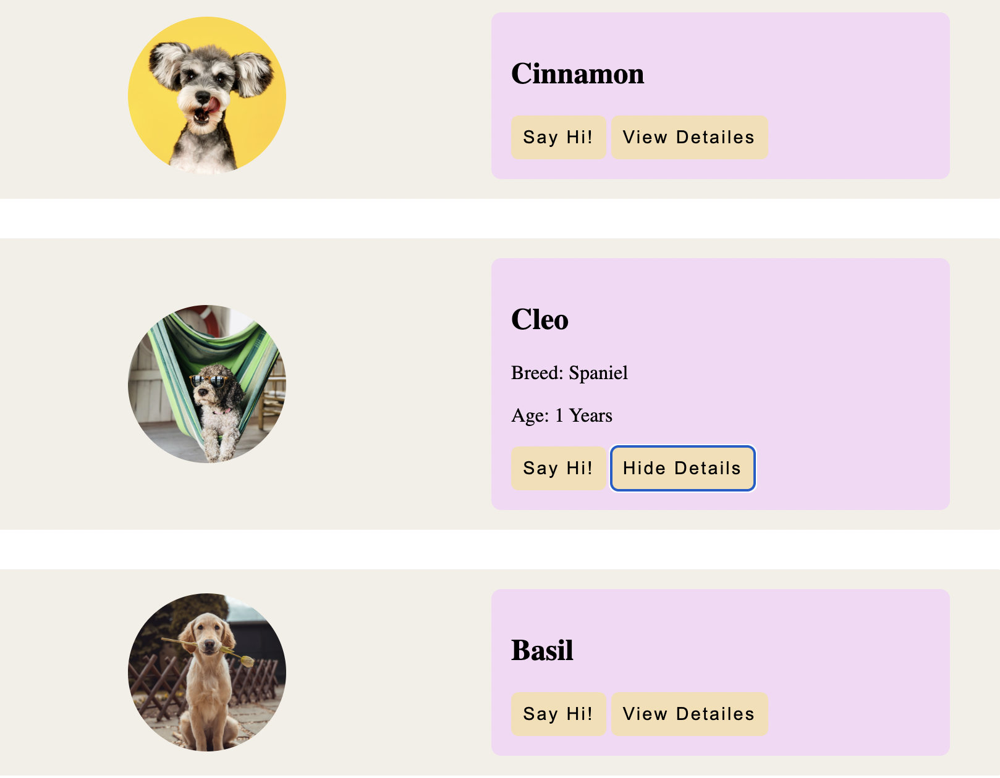

#### Web Components Examples

Web components encapsulate HTML, CSS and functionality so that they can be used without any interference in any project, based on any platform (such as Vue/React/Angular). They're a very handy way to integrate awesome UI elements created by others, and they also allow you and your team to share components that work on any platform.

1. User card

- [tutorial](https://www.youtube.com/watch?v=PCWaFLy3VUo)

    

2. Tooltip

- [tutorial](https://www.youtube.com/watch?v=mNtLjzzxGQM)
- Icon toggle functionality; we have a text with an icon alert inside; when the icon is clicked a pop up window is showing and the icon is changed. When we click again the window closes and icon changes back.

    

3. Search your name in Google

- [tutorial](https://academind.com/tutorials/web-components-introduction)

    

4. Cool Checkbox

- [tutorial](https://www.youtube.com/watch?v=xCeutzpRlzA)

    

5. Dogs Cards

- [tutorial](https://www.youtube.com/watch?v=gfvFEBXMVSU&t=787s)

    

    

